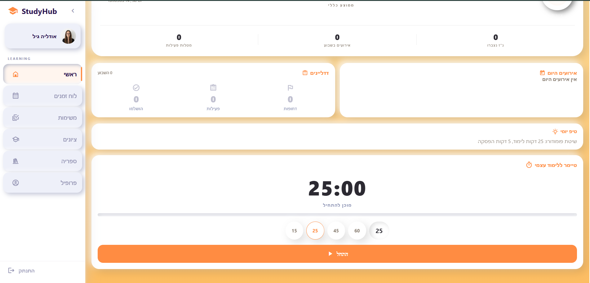
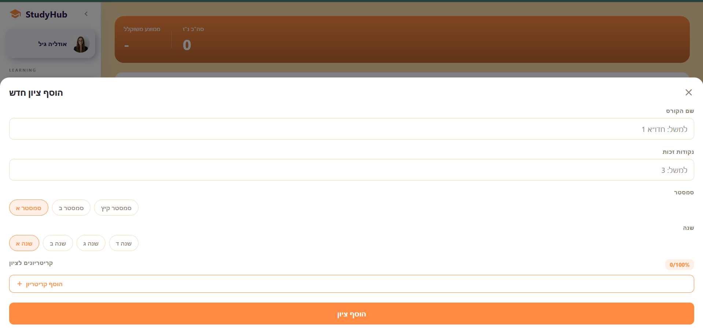
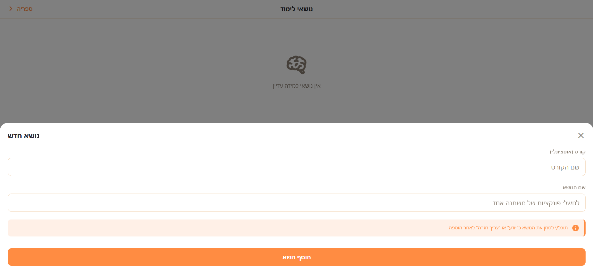
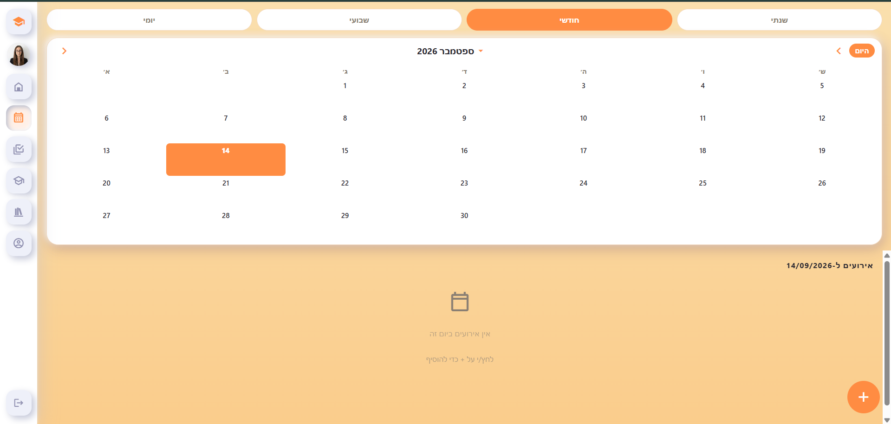

<div align="center">

# 🎓 StudyHub
### Your entire academic life, in one place.

[](https://github.com/OdelyaGil/StudyHub/actions/workflows/lint.yml)


</div>

---

### 🔗 [Live App](https://study-hub-coral-seven.vercel.app)

Open it in a mobile browser and add it to your home screen — StudyHub installs as a real app.

---

## 📖 About The Project

**StudyHub** is a full student productivity app built for managing everything a student juggles in one place: grades, tasks, a class schedule, study materials, and focused study time.

It runs from a single React Native + Expo codebase across iOS, Android, and the web, and is deployed today as an installable Progressive Web App backed by Firebase.

## 📸 Gallery (Screenshots)

<table>
  <tr>
    <td align="center"><br/>Dashboard</td>
    <td align="center"><br/>Adding a grade</td>
  </tr>
  <tr>
    <td align="center"><br/>Adding a learning topic</td>
    <td align="center"><br/>Schedule</td>
  </tr>
</table>

## ✨ Key Features

* 📊 **Dashboard** — daily overview, upcoming tasks and events, weighted grade average, a credit-progress ring, and a Pomodoro-style study timer.
* 📝 **Grades** — per-course tracking with automatic weighted-average and required-credits progress.
* ✅ **Tasks** — priorities, due dates, file attachments.
* 📅 **Schedule** — day / week / month / year calendar views, recurring events, and a per-event reminder picker.
* 🧠 **Learning tracker** — mark topics per course as known or needing review.
* 📚 **Study library** — Summaries, Glossary, Quiz Bank, Links, and Flashcards, all searchable.

## 🛡️ Security & Privacy Architecture

* 🔐 **Custom-verified auth** — Firebase Authentication backed by a dedicated Vercel serverless function that issues and emails branded verification links directly, instead of relying on Firebase's default flow.
* 🤖 **Bot & abuse protection** — Firebase App Check with reCAPTCHA v3 verifies that requests to Firebase come from the real app, not a scraped API key or an automated script.
* 🔒 **Face ID privacy lock** — an opt-in, on-device WebAuthn gate (Face ID / Touch ID / Windows Hello) that re-locks an already-signed-in session on every app open, independent of the Firebase login itself.
* 🧱 **Least-privilege data access** — Firestore security rules scope every read and write to the authenticated user's own document tree; there is no shared or public data path.

## 💻 Tech Stack

* **App:** React Native, Expo, TypeScript
* **Navigation:** React Navigation
* **Backend:** Firebase (Authentication, Firestore, App Check)
* **Serverless API:** Vercel (Node.js) + firebase-admin + Nodemailer
* **Web:** react-native-web, WebAuthn, Web Notifications API

## 🚀 Getting Started

The [live app](https://study-hub-coral-seven.vercel.app) above needs nothing from you — just open it. The steps below are only for running the source code yourself.

### Prerequisites

* Node.js 18+
* npm
* [Expo Go](https://expo.dev/go) (optional, for testing on a physical device without building)

### Installation & Configuration

> ⚠️ **Security notice:** API keys and service credentials are **not** included in this repository. Configure your own before running the project.

1. Clone the repository:
   ```bash
   git clone https://github.com/OdelyaGil/StudyHub.git
   cd StudyHub
   ```

2. Install dependencies:
   ```bash
   npm install
   ```

3. Connect a Firebase project (the app talks directly to Firebase, so it needs one to run at all — this doesn't have to be a paid or pre-existing project):
   * Create a free project at the [Firebase console](https://console.firebase.google.com), then add a Web app to it.
   * Enable **Authentication** (Email/Password provider) and **Firestore** for the project.
   * Copy `.env.example` to `.env`, then fill in the web app config values Firebase gives you (Project Settings → General → Your apps).

4. *(Optional)* To run the custom email-verification API yourself, set these as environment variables on your own Vercel project:
   * `FIREBASE_SERVICE_ACCOUNT` — a Firebase service account JSON (Project Settings → Service Accounts → Generate new private key), as a single-line string.
   * `GMAIL_USER` / `GMAIL_APP_PASSWORD` — a Gmail account with an [app password](https://myaccount.google.com/apppasswords) for sending mail.
   * `EXPO_PUBLIC_VERCEL_URL` — your deployed app's URL.

5. Run it:
   ```bash
   npx expo start --web    # Web
   npx expo start --ios    # iOS simulator
   npx expo start --android # Android emulator
   npx expo start          # Scan the QR code with Expo Go
   ```

## 📂 Project Structure

```text
StudyHub/
├── App.tsx                    # Root: auth state, Face ID gate, navigation shell
├── DashboardScreen.tsx         # Bottom-tab navigator + custom sidebar wiring
├── LoginScreen.tsx             # Sign in / register / email verification
├── api/
│   └── send-verification.js    # Vercel serverless function (custom verification email)
├── src/
│   ├── screens/                 # Home, Tasks, Grades, Schedule, Profile, Summaries,
│   │                             # Glossary, QuizBank, Links, Flashcards, Chats, Learning...
│   ├── components/               # AppSidebar, SwipeBackEdge, FaceLockGate, ErrorBoundary...
│   ├── context/                  # ThemeContext, TabHistoryContext
│   ├── utils/                    # firestore.ts, notifications.ts, faceLock.ts, helpers.ts
│   ├── hooks/                    # useCustomAlert
│   └── config/                   # firebase.ts
├── public/                      # PWA manifest, icons, service worker
├── firestore.rules
└── storage.rules
```

## 🧠 What I Learned

* **From Local to Production:** Moving a project from my local machine to a live, deployed environment taught me a lot about debugging backend services and deployment pipelines (Vercel & Firebase) when things don't work out of the box.
* **Cross-Platform Challenges:** Building an app that runs on web, iOS, and Android showed me how to handle differences between platforms and write smart fallbacks when a package doesn't support the web.
* **Security & User Experience:** Working on features like Face ID and secure authentication gave me hands-on experience in protecting user data while keeping the app smooth and usable.

## 👩‍💻 Developed By

<div align="center">

**Odelya Gil**
<br>
[](https://www.linkedin.com/in/odelyagil/) [](https://github.com/OdelyaGil)

</div>
